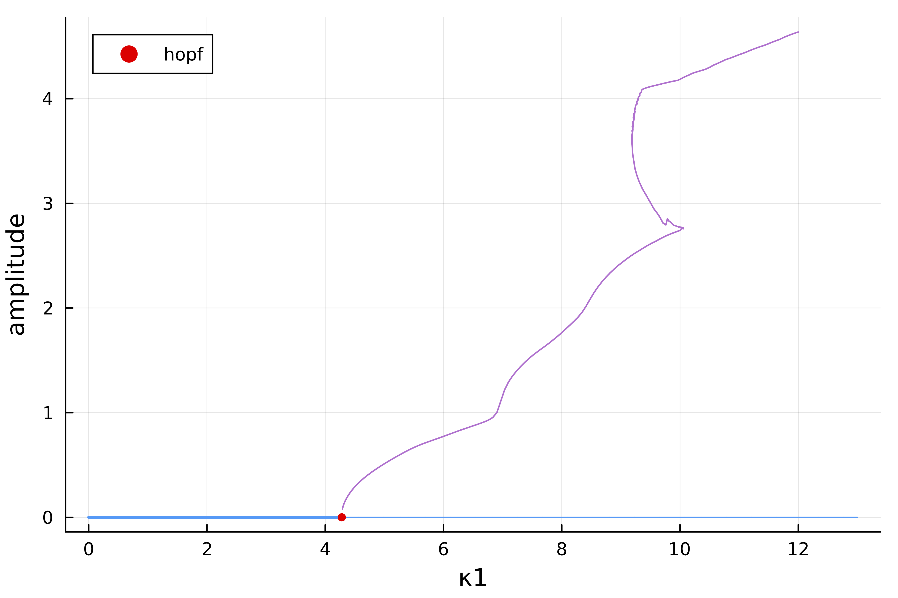

# Humphries model (codim 2, periodic orbit)

```@contents
Pages = ["Humphries.md"]
Depth = 3
```
Consider the model [^Hum] as an example of state-dependent delays

$$x^{\prime}(t)=-\gamma x(t)-\kappa_1 x\left(t-a_1-c x(t)\right)-\kappa_2 x\left(t-a_2-c x(t)\right)$$


## Continuation and codim 1 bifurcations

We first instantiate the model

```@example TUTHumphries
using Revise, DDEBifurcationKit, Parameters, Plots
using BifurcationKit
const BK = BifurcationKit

function humpriesVF(x, xd, p)
   @unpack κ1,κ2,γ,a1,a2,c = p
   [
      -γ * x[1] - κ1 * xd[1][1] - κ2 * xd[2][1]
   ]
end

function delaysF(x, par)
   [
      par.a1 + par.c * x[1],
      par.a2 + par.c * x[1],
   ]
end


pars = (κ1=0.,κ2=2.3,a1=1.3,a2=6,γ=4.75,c=1.)
x0 = zeros(1)

prob = SDDDEBifProblem(humpriesVF, delaysF, x0, pars, (@lens _.κ1))
```

We then compute the branch

```@example TUTHumphries
optn = NewtonPar(verbose = true, eigsolver = DDE_DefaultEig())
opts = ContinuationPar(p_max = 13., p_min = 0., newton_options = optn, ds = -0.01, detect_bifurcation = 3, nev = 3, )
br = continuation(prob, PALC(), opts; verbosity = 0, bothside = true)
```

and plot it

```@example TUTHumphries
scene = plot(br)
```

## Continuation of Hopf point

We follow the Hopf points in the parameter plane $(\kappa_1,\kappa_2)$.
We tell the solver to consider br.specialpoint[2] and continue it.

```@example TUTHumphries
brhopf = continuation(br, 2, (@lens _.κ2),
         setproperties(br.contparams, detect_bifurcation = 2, dsmax = 0.04, max_steps = 230, p_max = 5., p_min = -1.,ds = -0.02);
         verbosity = 0, plot = false,
         # we disable detection of Bautin bifurcation as the
         # Hopf normal form is not implemented for SD-DDE
         detect_codim2_bifurcation = 0,
         bothside = true,
         start_with_eigen = true)

scene = plot(brhopf, vars = (:κ1, :κ2))
```

## Branch of periodic orbits

We compute the branch of periodic orbits from the Hopf bifurcation points using orthogonal collocation. We use a lot of time sections $N_{tst}=200$ to have enough precision to resolve the sophisticated branch of periodic solutions especially near the first Fold point around $\kappa_1\approx 10$.

```julia
# continuation parameters
opts_po_cont = ContinuationPar(dsmax = 0.05, ds= 0.001, dsmin = 1e-4, p_max = 12., p_min=-5., max_steps = 3000,
	nev = 3, tol_stability = 1e-8, detect_bifurcation = 0, plot_every_step = 20, save_sol_every_step=1)
@set! opts_po_cont.newton_options.tol = 1e-9
@set! opts_po_cont.newton_options.verbose = true

# arguments for periodic orbits
args_po = (	record_from_solution = (x, p) -> begin
		xtt = BK.get_periodic_orbit(p.prob, x, nothing)
		_max = maximum(xtt[1,:])
		_min = minimum(xtt[1,:])
		return (amp = _max - _min,
				period = getperiod(p.prob, x, nothing))
	end,
	plot_solution = (x, p; k...) -> begin
		xtt = BK.get_periodic_orbit(p.prob, x, nothing)
		plot!(xtt.t, xtt[1,:]; label = "x", k...)
		plot!(br; subplot = 1, putspecialptlegend = false)
		end,
	normC = norminf)

probpo = PeriodicOrbitOCollProblem(200, 2; N = 1, jacobian = BK.AutoDiffDense())
br_pocoll = continuation(
	br, 2, opts_po_cont,
	probpo;
	alg = PALC(tangent = Bordered()),
	# regular continuation options
	verbosity = 2,	plot = true,
	args_po...,
	ampfactor = 1/0.467829783456199 * 0.1,
	δp = 0.01,
	callback_newton = BK.cbMaxNorm(10.0),
	)	
```

which gives



## References
[^Hum]: > Humphries et al. (2012), Dynamics of a delay differential equation with multiple state-dependent delays, Discrete and Continuous Dynamical Systems 32(8) pp. 2701-2727 http://dx.doi.org/10.3934/dcds.2012.32.2701)